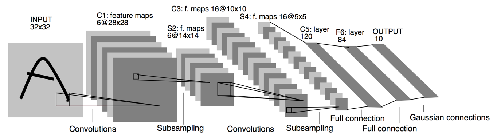
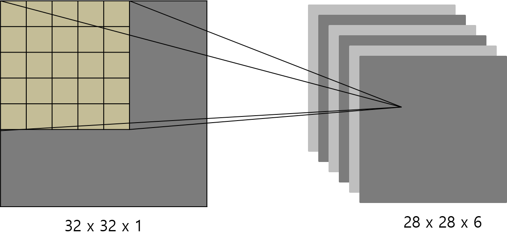
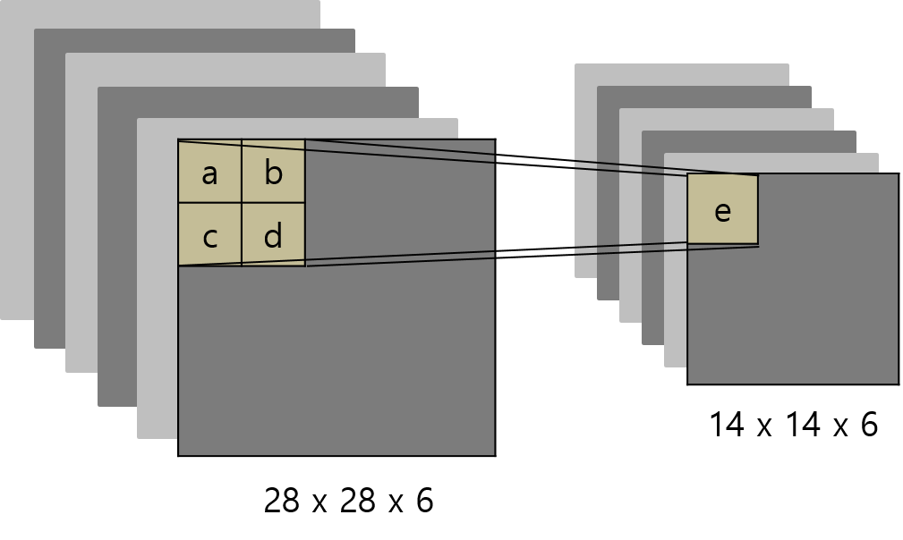
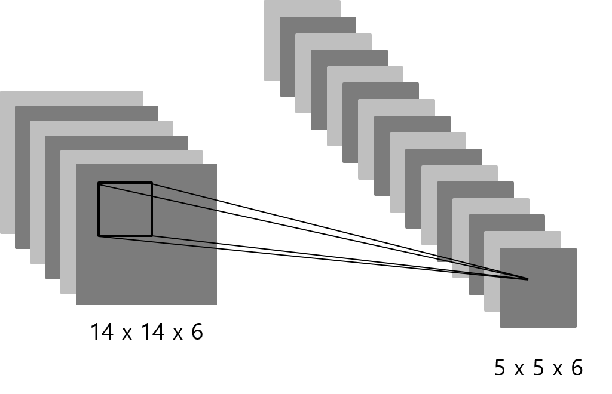

# C++ implementation of LeNet-5

### 이 코드는 데이터분석캡스톤디자인 과목에서 수행한 프로젝트의 결과물입니다.

## 1. LeNet-5의 구조

LeNet-5는 2개의 convolutional layer와 subsampling layer, 그리고 3개의 fully connected layer로 이루어져 있습니다. 각 layer에서 생성되는 output의 크기는 아래의 표와 같습니다.

|Input|Convolution|Pooling|Convolution|Pooling|Dense|Dense|Dense|
|:---:|:---------:|:-----:|:---------:|:-----:|:---:|:---:|:---:|
|28x28x6|28x28x6|14x14x6|10x10x6|5x5x16|120|84|10|

### (1) C1: Convolutional layer

첫 번째 컨볼루션 층은 28x28 크기의 입력 이미지를 5x5 크기의 필터로 컨볼루션합니다. 이때 입력과 출력 이미지의 크기를 같게 하기 위해 2 번의 zero padding을 입력 이미지에 더합니다. 출력 이미지는 크기는 28x28로 총 6개가 생성됩니다.   

### (2) S2: Subsampling layer

두 번째 층은 풀링 층입니다. 28x28 크기의 입력 이미지를 2x2 크기로 풀링하는데, 이때 stride는 2입니다. 또한 이렇게 풀링한 이미지를 활성 함수에 입력하여 최종적인 출력 이미지를 생성합니다. 아래의 그림을 예로 들면 e = tanh((a + b + c + d) * x + y)와 같이 계산됩니다. 이때 x와 y는 학습시켜야 하는 파라미터입니다. 

### (3) Convolutional Layer

세 번째 층은 컨볼루션 층입니다. 이 층에서는 6장의 입력 이미지 중 몇 장을 선택 후 이를 컨볼루션하여 하나의 출력 이미지를 생성합니다. 아래의 행렬을 예로 들어 설명하겠습니다. 이 행렬의 row index는 이전 층의 출력 이미지를 의미하고, col index는 현재 층의 출력 이미지를 의미합니다. 또한 행렬 내의 x 표시는 row index에 해당하는 이전 층의 출력 이미지와 column index에 해당하는 현재 층의 필터를 컨볼루션한다는 것입니다. 한편 아래 행렬의 첫 번째 column은 row가 0, 1, 2 일 때 각각 x를 갖습니다. 이는 현재 layer의 첫 번째 output image가 이전 layer의 첫 번째, 두 번째, 세 번째 output image를 모두 컨볼루션하여 생성된다는 것을 뜻합니다.

|   | 0 | 1 | 2 | 3 | 4 | 5 | 6 | 7 | 8 | 9 | 10| 11| 12| 13| 14| 15|
|:-:|:-:|:-:|:-:|:-:|:-:|:-:|:-:|:-:|:-:|:-:|:-:|:-:|:-:|:-:|:-:|:-:|
| 0 | x |   |   |   | x | x | x |   |   | x | x | x | x |   | x | x |
| 1 | x | x |   |   |   | x | x | x |   |   | x | x | x | x |   | x |
| 2 | x | x | x |   |   |   | x | x | x |   |   | x |   | x | x | x |
| 3 |   | x | x | x |   |   | x | x | x | x |   |   | x |   | x | x |
| 4 |   |   | x | x | x |   |   | x | x | x | x |   | x | x |   | x |
| 5 |   |   |   | x | x | x |   |   | x | x | x | x |   | x | x | x |

## 2. Activation function

- LeNet-5는 활성 함수로 hyperbolic tangent를 사용합니다.
- f(a) = A * tanh(S * a)
- 이때 A는 1.7159로 tanh 함수의 amplitude를 결정합니다.
- S는 2/3로 원점에서의 기울기의 크기와 관련이 있습니다.

## 3. Loss function

작성중

## 4. Initialization

작성중

## 5. Back propagation

작성중

## 6. C++ Implementation

### (1) 파일 구조

|File|Description|
|:--:|:---------:|
|Matrix.h|2차원 동적 배열로 구현한 행렬 클래스.|
|common.h|Dense, Conv2D, Pool2D에서 필요로 하는 함수가 구현되어 있음.|
|Dense.h|Fully connected layer를 구현한 클래스. |
|Conv2D.h|Convolutional layer를 구현한 클래스.|
|Pool2D.h|Pooling layer를 구현한 클래스.|
|CNN.h|위 세 개의 layer로 구성된 전체 네트워크를 구현한 클래스.|
|file_manage.h|이미지를 읽고 학습한 모델의 결과를 쓰는 함수가 구현되어 있음.|
|main.cpp|메인 함수가 구현되어 있음.|

### (2) 클래스 구조

- Dense class

~~~cpp
class Dense
{
public:
	int n_node;
	int n_input;
	Vector sum;
	Vector output;
	Vector delta;
	Matrix W;
	Matrix dW;
	Vector b;
	Vector db;
public:
	Dense(int n_node, int n_input, int init_opt = 0);
	~Dense() {}
	void forward_propagate(const Vector& prev_out);
	Vector backward_propagate(double label, const Vector& prev_out);
	Vector backward_propagate(const Vector& prev_out);
	void update_weight(double l_rate);
	void print_layer();
};
~~~

- Conv2D class

~~~cpp
class Conv2D
{
public:
	int in_size;
	int filt_size;
	int out_size;
	int n_in;
	int n_out;
	int pad;
	vector<Matrix> sum;
	vector<Matrix> output;
	vector<Matrix> delta;
	vector<Matrix> Ws;
	vector<Matrix> dWs;
	Vector b;
	Vector db;
	vector<vector<int>> indices;
public:
	Conv2D(const vector<int>& input_size, const vector<int>& filter_size, int pad = 0, int init_opt = 0, const vector<vector<int>>& indices = {});
	~Conv2D() {}
	void forward_propagate(const Matrix& x);
	void forward_propagate(const vector<Matrix>& prev_out);
	vector<Matrix> backward_propagate(const vector<Matrix>& prev_out);
	void backward_propagate(const Matrix& prev_out);
	void update_weight(double l_rate);
};
~~~

Conv2D 생성자의 파라미터 중 indices는 input feature map 여러 개를 섞어서 컨볼루션 연산을 하고 싶을 때 사용할 수 있습니다. 예를 들어 아래와 같은 indices가 있다고 하겠습니다. 이때 row의 index는 이전 층의 출력 이미지이고, column은 현재 층의 출력 이미지입니다. 또한 행렬 내의 x 표시는 row index에 해당하는 이전 층의 출력 이미지와 column index에 해당하는 현재 층의 필터를 컨볼루션한다는 것입니다. 다시 말해 (0, 0) = x 라는 것은 이전 layer의 첫 번째 출력 이미지와 현재 층의 첫 번째 필터와 컨볼루션한다는 것입니다. 한편 아래 행렬의 첫 번째 column은 row가 0, 1, 2 일 때 각각 x를 갖습니다. 이는 현재 layer의 첫 번째 output image가 이전 layer의 첫 번째, 두 번째, 세 번째 output image를 모두 컨볼루션하여 생성된다는 것을 뜻합니다.

|   | 0 | 1 | 2 | 3 | 4 | 5 | 6 | 7 | 8 | 9 | 10| 11| 12| 13| 14| 15|
|:-:|:-:|:-:|:-:|:-:|:-:|:-:|:-:|:-:|:-:|:-:|:-:|:-:|:-:|:-:|:-:|:-:|
| 0 | x |   |   |   | x | x | x |   |   | x | x | x | x |   | x | x |
| 1 | x | x |   |   |   | x | x | x |   |   | x | x | x | x |   | x |
| 2 | x | x | x |   |   |   | x | x | x |   |   | x |   | x | x | x |
| 3 |   | x | x | x |   |   | x | x | x | x |   |   | x |   | x | x |
| 4 |   |   | x | x | x |   |   | x | x | x | x |   | x | x |   | x |
| 5 |   |   |   | x | x | x |   |   | x | x | x | x |   | x | x | x |

- Pool2D
~~~cpp
class Pool2D
{
public:
	int in_size;
	int filt_size;
	int out_size;
	int n_in;
	int n_out;
	int stride;
	int pool_opt;
	vector<Matrix> output;
	vector<Matrix> delta;
public:
	Pool2D(const vector<int>& input_size, const vector<int>& filter_size, int stride = 1, int pool_opt = 0);
	~Pool2D() {}
	void forward_propagate(const vector<Matrix>& prev_out);
	vector<Matrix> backward_propagate(const vector<Matrix>& prev_out);
};
~~~

- CNN
~~~cpp
struct Layer
{
	string type;
	Dense* dense;
	Conv2D* conv;
	Pool2D* pool;
	Layer(string type, Dense* dense, Conv2D* conv2d, Pool2D* pool2d) : 
		type(type), dense(dense), conv(conv2d), pool(pool2d) {}
	~Layer() {}
};

class CNN
{
public:
	vector<Layer> net;
public:
	CNN() {}
	void add(Dense* layer);
	void add(Conv2D* layer);
	void add(Pool2D* layer);
	void fit(const vector<Matrix>& X, const Vector& Y, double l_rate = 0.001, int n_epoch = 100, int batch = 30);
	Vector predict(const vector<Matrix>& X);
};
~~~

